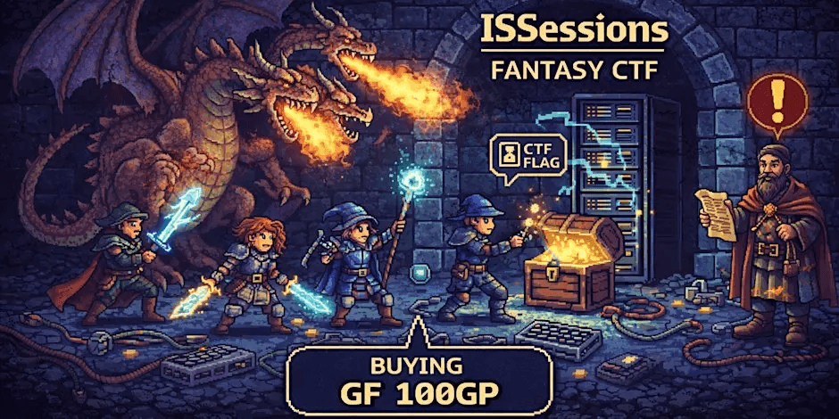

## ⚔️ ISSessions Fantasy CTF - Guild Quest Board 🛡️

> *"The Quest Giver is watching. The rankings await."*

A high-fantasy themed live scoreboard for CTFd, built for **ISSessions Fantasy CTF 2026**. Features an animated tavern background with aurora effects, floating fireflies, fog layers, and immersive D&D/Baldur's Gate 3 inspired visuals.



---

https://github.com/user-attachments/assets/a80b40eb-f692-4377-9147-d56b85102945

### 🏰 Features

- **Animated Tavern Background** - Layered WebGL aurora, floating fireflies, drifting fog, and film grain
- **Click Sparks** - Gold particle effects on every click
- **Fantasy Terminology** - Teams are "Adventuring Parties", points are "Gold Pieces (GP)"
- **Animated Counters** - Scores roll up with smooth number animations
- **Medieval Aesthetic** - Warm amber, gold, and parchment color scheme
- **Responsive Design** - Works on guild halls of all sizes (mobile-friendly)
- **Auto-refresh** - Scries the CTFd API every 30 seconds
- **XSS Protected** - All user data sanitized before rendering

### 🛠️ Tech Stack

- **React 19** + TypeScript
- **Vite 7** - Lightning fast builds
- **Tailwind CSS 4** - Custom `@theme` with tavern colors
- **Framer Motion + GSAP** - Smooth animations
- **Radix UI + shadcn/ui** - Accessible components

### 🗡️ Installation

```bash
# Clone the repository
git clone https://github.com/jondmarien/CTFd-Scoreboard.git
cd CTFd-Scoreboard

# Install dependencies
bun install

# Start dev server (proxies API to CTFd)
bun run dev
```

Open `http://localhost:8000` - the Vite dev server proxies `/api/*` to `issessionsctf.ctfd.io` automatically.

### 🚀 Deployment (Vercel — Recommended)

1. Push the repo to GitHub
2. Import the project at [vercel.com/new](https://vercel.com/new)
3. Add the environment variable `CTFD_API_TOKEN` in **Settings → Environment Variables**
   - Generate a token at your CTFd instance under Settings → API Tokens
4. Deploy — Vercel auto-detects Vite, installs with Bun, and builds

The included `vercel.json` handles API proxying via a serverless function that injects the auth token server-side.

**Custom domain:** Add your domain in Vercel project Settings → Domains, then create a CNAME record pointing to `cname.vercel-dns.com`.

### 🐳 Docker (Deprecated — Supported for Self-Hosting)

> **Note:** Docker deployment is deprecated in favor of Vercel. The Dockerfile is kept for self-hosting scenarios. If using Docker, you'll need to configure the CTFd API token separately (e.g. via nginx proxy headers).

```bash
# Build locally
docker build -t fantasy-ctf-scoreboard .
docker run -p 80:80 fantasy-ctf-scoreboard
```

### 📜 Configuration

**Environment Variables:**

| Variable | Required | Description |
|----------|----------|-------------|
| `CTFD_API_TOKEN` | Yes | API token for your CTFd instance (private scoreboards) |

**Dev proxy** is configured in `vite.config.ts` — the Vite dev server proxies `/api/*` to `issessionsctf.ctfd.io` automatically. No separate config file needed.

### 📁 Project Structure

```tree
src/
├── components/
│   ├── TavernBackground.tsx  # Aurora + Fireflies + Fog + Noise
│   ├── Scoreboard.tsx        # Main scoreboard container
│   ├── TeamCard.tsx          # Expandable team rows
│   ├── Header.tsx            # Banner + animated title
│   └── ...                   # Animation components
├── hooks/
│   └── useScoreboard.ts      # Data fetching + XSS sanitization
└── App.tsx                   # Root component
```

### 🐉 Credits

- **Theme**: ISSessions Fantasy CTF 2026
- **Developer**: Jonathan Marien
- **API**: [CTFd](https://docs.ctfd.io/docs/api/getting-started/)
- **Animations**: [Framer Motion](https://motion.dev), [GSAP](https://gsap.com)

---

*Enter the Realm. Accept the Quest. 👁️✨*
