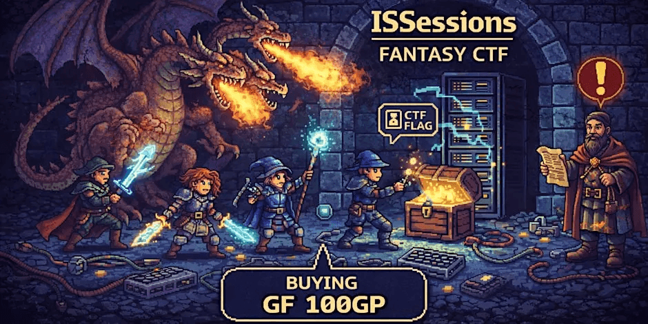

# ⚔️ ISSessions Fantasy CTF - Guild Quest Board 🛡️

> *"The Quest Giver is watching. The rankings await."*

A high-fantasy themed live scoreboard for CTFd, built for **ISSessions Fantasy CTF 2026**. Features an animated tavern background with aurora effects, floating fireflies, fog layers, and immersive D&D/Baldur's Gate 3 inspired visuals.



---

<https://github.com/user-attachments/assets/a80b40eb-f692-4377-9147-d56b85102945>

## 🏰 Features

### Visuals & Animations

- **Animated Tavern Background** — Layered WebGL aurora, floating fireflies, drifting fog, and film grain
- **Click Sparks** — Gold particle effects on every click
- **Animated Counters** — Scores roll up with smooth number animations
- **Medieval Aesthetic** — Warm amber, gold, and parchment color scheme
- **FOUC Prevention** — Page hidden until stylesheets load for a clean first paint

### Scoreboard View

- **Live Rankings** — Adventuring Parties ranked by Gold Pieces (GP)
- **Expandable Team Cards** — Click a team to see members and their scores
- **Adventurer Modal** — Click any member to see their quest log, solves by category, and stats
- **Team Summary Modal** — View full team details including affiliation, country, and website

### Quests View

- **Quest Board** — All challenges grouped by category (realm), sorted by value
- **Quest Detail Modal** — Click any quest to see description, current/original GP value, solve count, tags, max attempts, and value decay for dynamic challenges
- **Mock Data Fallback** — Fantasy-themed sample quests displayed before the competition begins

### Guilds View

- **Guild Registry** — Browse all registered guilds with member counts and scores
- **Adventurer & Team Modals** — Drill into any guild or member for full details

### Adventurers View

- **Individual Rankings** — Every adventurer ranked by their personal Gold Pieces, derived from scoreboard data
- **Adventurer Modal** — Click any adventurer for their full quest log and stats

### Changelog (Chronicle of Changes)

- **📜 Scroll Icon** — Access the changelog via the scroll button next to the view selector
- **Timeline Layout** — A vertical timeline with dates, version badges, and tags
- **Fantasy Themed** — Styled with the same amber-and-stone palette and medieval fonts as the rest of the board
- **Full History** — Every major update since the React rebuild documented in rich detail

### General

- **Fantasy Terminology** — Teams are "Guilds", points are "Gold Pieces (GP)", challenges are "Quests", categories are "Realms"
- **Last Scrying Footer** — Shows when data was last refreshed on every view
- **Auto-refresh** — Scries the CTFd API every 30 seconds with server-side caching
- **Responsive Design** — Works on guild halls of all sizes (mobile-friendly)
- **XSS Protected** — All user data sanitized before rendering

## 🛠️ Tech Stack

- **React 19** + TypeScript
- **Vite 7** — Lightning fast builds
- **Tailwind CSS 4** — Custom `@theme` with tavern colors
- **Framer Motion + GSAP** — Smooth animations
- **Radix UI + shadcn/ui** — Accessible components
- **Vercel Serverless Functions** — API proxy with Bun runtime
- **Bun** — Package manager and runtime

## 🗡️ Installation

```bash
# Clone the repository
git clone https://github.com/jondmarien/ctfd-live-scoreboard.git
cd ctfd-live-scoreboard

# Install dependencies
bun install

# Start dev server (proxies API to CTFd)
bun run dev
```

Open `http://localhost:8000` — the Vite dev server proxies `/api/*` to `issessionsctf.ctfd.io` automatically.

## 🚀 Deployment (Vercel — Recommended)

1. Push the repo to GitHub
2. Import the project at [vercel.com/new](https://vercel.com/new)
3. Add environment variables in **Settings → Environment Variables** (see [Configuration](#-configuration))
4. Deploy — Vercel auto-detects Vite, installs with Bun, and builds

The included `vercel.json` handles:

- **API proxying** via a catch-all serverless function (`api/[...path].ts`) that injects the auth token server-side
- **Server-side caching** with `s-maxage=30` and `stale-while-revalidate=60` to reduce polling load
- **SPA routing** — all non-API routes rewrite to `index.html`

**Custom domain:** Add your domain in Vercel project Settings → Domains, then create a CNAME record pointing to `cname.vercel-dns.com`.

## 🐳 Docker (Deprecated — Supported for Self-Hosting)

> **Note:** Docker deployment is deprecated in favor of Vercel. The Dockerfile is kept for self-hosting scenarios. If using Docker, you'll need to configure the CTFd API token separately (e.g. via nginx proxy headers).

```bash
# Build locally
docker build -t fantasy-ctf-scoreboard .
docker run -p 80:80 fantasy-ctf-scoreboard
```

## 📜 Configuration

| Variable | Required | Description |
| -------- | -------- | ----------- |
| `CTFD_API_TOKEN` | Yes | API token for your CTFd instance (private scoreboards) |
| `WEBHOOK_URL` | Yes | Discord channel webhook URL for First Blood announcements |
| `WEBHOOK_SECRET` | Yes | CTFd shared secret for webhook validation (Admin → Webhooks) |

**Dev proxy** is configured in `vite.config.ts` — the Vite dev server proxies `/api/*` to `issessionsctf.ctfd.io` automatically. No separate config file needed.

## 🩸 First Blood Discord Webhook

When a challenge is solved for the first time, CTFd pushes a **First Blood** event to a Vercel serverless function at `/api/webhook/firstblood`. The function enriches the event with challenge/solver details from the CTFd API and sends a fantasy-themed Discord embed to the configured webhook channel.

### Webhook Setup

1. In CTFd **Admin → Webhooks**, copy the **Shared Secret** → add as `WEBHOOK_SECRET` in Vercel
2. Add webhook target: `https://<your-domain>/api/webhook/firstblood`
3. Select the **First Blood** event type
4. CTFd validates the endpoint automatically, then pushes events on first solves

## 📁 Project Structure

```tree
src/
├── components/
│   ├── animation/              # Reusable animation primitives
│   │   ├── AnimatedContent.tsx  # Scroll-triggered reveal
│   │   ├── AnimatedList.tsx     # Staggered list animations
│   │   ├── ClickSpark.tsx       # Gold particle click effects
│   │   ├── Counter.tsx          # Animated number counter
│   │   ├── ShinyText.tsx        # Shimmer text effect
│   │   └── SplitText.tsx        # Per-character text animation
│   ├── background/             # Tavern atmosphere layers
│   │   ├── TavernBackground.tsx # Composition root
│   │   ├── Aurora.tsx           # WebGL aurora borealis
│   │   ├── Fireflies.tsx        # Floating particle fireflies
│   │   ├── Fog.tsx              # Drifting fog layers
│   │   └── Noise.tsx            # Film grain overlay
│   ├── modals/                 # Detail modals
│   │   ├── AdventurerModal.tsx  # Player stats & quest log
│   │   ├── QuestModal.tsx       # Challenge details & description
│   │   └── TeamSummaryModal.tsx # Full team overview
│   └── ui/                     # Core UI components
│       ├── Scoreboard.tsx       # Main container + view switching
│       ├── ViewSelector.tsx     # Tab bar (Scoreboard / Guilds / Adventurers / Quests) + 📜 changelog button
│       ├── TeamCard.tsx         # Expandable team row
│       ├── ChallengesView.tsx   # Quest board grouped by realm
│       ├── TeamsView.tsx        # Guild registry list
│       ├── AdventurersView.tsx  # Individual adventurer rankings
│       ├── ChangelogView.tsx    # Chronicle of Changes timeline
│       ├── Header.tsx           # Banner + animated title
│       ├── SpotlightCard.tsx    # Mouse-follow spotlight card
│       └── StarBorder.tsx       # Animated border effect
├── hooks/                      # Data fetching & state
│   ├── useScoreboard.ts         # Scoreboard data + XSS sanitization
│   ├── useTeamsList.ts          # Teams list with member details
│   ├── useChallengeCache.ts     # Challenge cache + mock data fallback
│   ├── useTeamDetails.ts        # Individual team details
│   └── useAdventurerDetails.ts  # Individual player details
├── data/
│   └── changelog.ts             # Changelog entries (typed array)
├── lib/
│   ├── animations.ts            # Shared Framer Motion variants
│   └── utils.ts                 # Utility functions
├── App.tsx                      # Root component
└── main.tsx                     # Entry point

api/                             # Vercel serverless functions (Bun runtime)
├── [...path].ts                 # Catch-all API proxy → CTFd with auth injection
└── webhook/
    └── firstblood.ts            # First Blood → Discord webhook handler
```

## 🐉 Credits

- **Theme**: ISSessions Fantasy CTF 2026
- **Developer**: [Jonathan Marien](https://github.com/jondmarien)
- **API**: [CTFd](https://docs.ctfd.io/docs/api/getting-started/)
- **Animations**: [Framer Motion](https://motion.dev), [GSAP](https://gsap.com)

---

*Enter the Realm. Accept the Quest. 👁️✨*